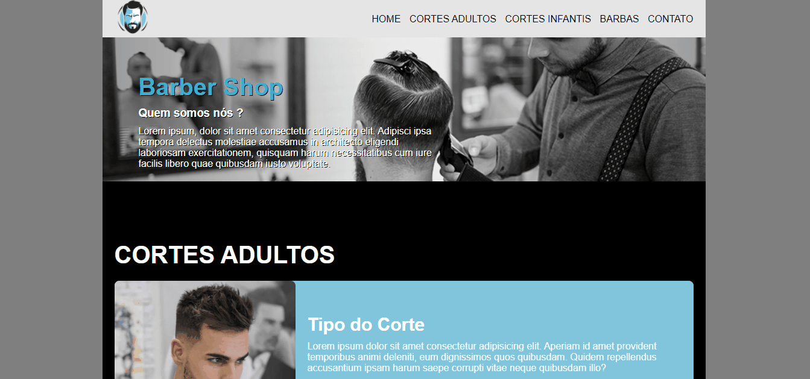

<h1>Protótipo  de  um Website de Barbearia </h1>

# Sobre

Nesse projeto é apenas um teste para treinar meus conhecimentos em HTML e CSS . O projeto consiste em um site para apresentar uma Barbearia , expondo seu trabalho . E os clientes entrarem em contato com o estabelecimento.

# Pre-Requisitos

É necessário usar o alguma plataforma que aceite códigos , como <a href="https://code.visualstudio.com/">VSCode</a> e usar as tecnologias <a href="https://developer.mozilla.org/pt-BR/docs/Web/HTML">HTML</a> e <a href="https://developer.mozilla.org/pt-BR/docs/Web/CSS">CSS</a> para a construção do projeto. 

# Tecnologias
<ul>
<li>HTML</li>
<li>CSS</li>
</ul>

# Imagens-Gifs
<h1 align="center">

</h1>
<h1 align="center">

</h1>

<h3>Projeto na web</h3>
<a href="https://agitated-kalam-77fca9.netlify.app/">Link do Projeto</a>
